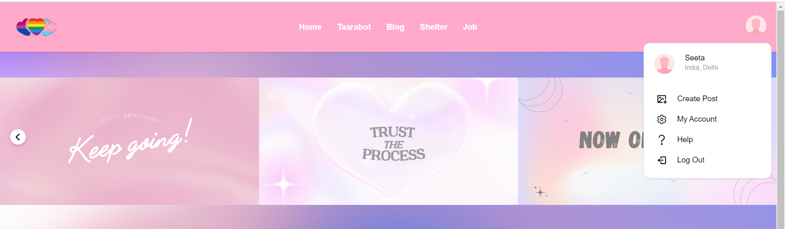
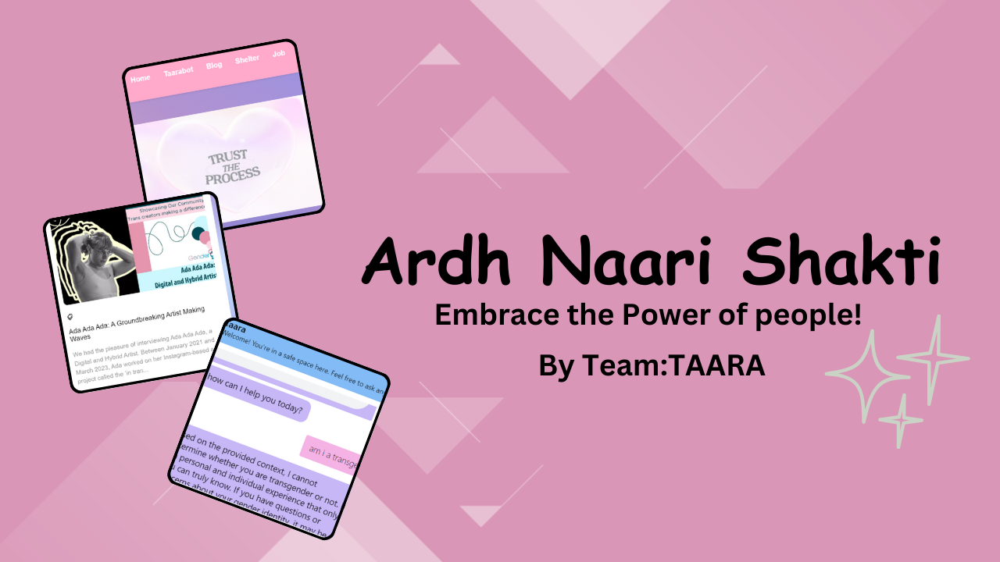

# Ardh-Naari-Shakti

*Problem Statement*: Transgender individuals encounter societal hurdles, from discrimination to familial rejection, often leading to confusion upon realizing their true identity. This confusion affects their access to employment and housing, emphasizing the importance of supportive environments and understanding for their well-being.It solves the sustainability goal : Peace,Justice and institutions

*Our Solution*:
Empowering and supporting the transgender community through technology and community-driven initiatives.

1.Supportive Chatbot: Confidential platform offering guidance and clarity for individuals questioning their gender identity.

2.Job Opportunities Hub: Connecting transgender individuals with employment opportunities, fostering economic independence.

3.Safe Spaces Locator: Providing information on safe spaces and communities for those facing rejection or discrimination.

4.Blogs feature: Sharing experiences builds community and insight maintaining a supportive, respectful space with content moderation.

Website Link: https://ardhnaarishaktitaara.netlify.app

#How to use our product?
1. Kindly navigate to our website through the link provided above.
2. Then for using it ,kindly register on the website and then login
3. After completing this procedure you can use all the features that is in the website

#DEMO Video

